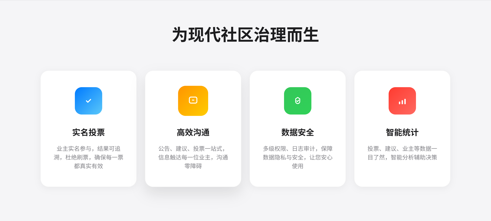

# 业主线上投票与自治系统


## 项目介绍

业主线上投票与自治系统是一个专为中国小区业主设计的Web端投票平台，旨在依法合规地组织业主大会与投票，提高大型小区的投票效率与决策透明度，提供业主与业委会/物业的互动与监督通道。


### 核心功能

- **实名认证**：支持房产证+身份证实名认证，确保投票人身份真实有效
- **线上投票**：支持多种投票形式，按户/按面积权重设置，实时结果统计
- **公告公示**：投票结果公示、业主大会纪要、财务报告等公告展示
- **意见互动**：业主可提交意见建议，支持点赞、物业反馈功能
- **多级管理**：系统管理员/小区管理员/普通业主的多级权限体系

## 系统功能

本系统为小区业主提供线上投票和自治平台，主要功能包括：

1. 业主实名认证
2. 投票发起与参与
3. 公告发布与阅读
4. 意见建议互动
5. 多级管理员体系

## 性能与安全优化

### 最近优化内容

1. **投票功能高并发支持**
   - 实现基于内存的分布式锁，防止重复投票
   - 对投票记录读取操作添加缓存支持，提高性能

2. **投票结果服务优化**
   - 新增投票结果缓存服务
   - 支持按票数和权重计算投票结果
   - 使用缓存提高结果查询性能

3. **系统监控功能**
   - 添加JVM内存、运行时间等系统指标监控
   - 记录API请求统计和错误统计
   - 监控缓存使用情况

4. **性能监控与统计**
   - 添加性能监控拦截器
   - 收集请求处理时间
   - 提供监控数据REST API

### 最新优化内容

5. **单元测试覆盖**
   - VoteRecordService测试 - 验证投票记录相关功能
   - VoteResultService测试 - 验证投票结果统计逻辑
   - VoteTopicController测试 - 验证API接口行为

6. **数据库索引优化**
   - 为高频查询字段添加索引
   - 复合索引支持多条件查询
   - 为关联查询添加外键索引

7. **安全性增强**
   - 更严格的内容安全策略
   - CSRF防护和XSS过滤
   - JWT令牌认证与授权
   - 敏感操作请求频率限制

8. **前端错误处理**
   - 全局统一错误提示组件
   - 错误自动重试功能
   - API错误智能分类处理
   - 用户友好的错误提示

9. **数据库版本管理**
   - 使用Flyway进行数据库版本控制
   - V1脚本初始化完整数据库结构
   - V2脚本优化数据库索引
   - V3脚本提供基础测试数据
   - 自动迁移确保环境一致性

## 技术架构

- 前端：Vue 3 + Element-Plus
- 后端：Spring Boot + Spring Security + Spring Data JPA
- 数据库：MySQL
- 缓存：基于内存的缓存（可扩展为Redis）
- 文件存储：MinIO（本地部署对象存储）
- OCR识别：PaddleOCR（开源本地识别）
- 部署方式：Docker Compose + Nginx + HTTPS

## 快速开始

### 环境要求

- Docker 20.10+
- Docker Compose 2.0+
- Node.js 16+ (开发环境)
- JDK 11+ (开发环境)

### 开发环境搭建

1. 克隆项目
```bash
git clone https://github.com/junyuzhan/owner-voting.git
cd owner-voting
```

2. 启动开发环境依赖服务
```bash
docker-compose -f docker-compose.dev.yml up -d
```

3. 前端开发
```bash
cd frontend
npm install
npm run dev
```

4. 后端开发
```bash
cd backend
./mvnw spring-boot:run
```

### 生产环境部署

1. 配置环境变量
```bash
cp .env.example .env
# 编辑.env文件，设置必要的环境变量
```

2. 构建并启动服务
```bash
docker-compose up -d
```

3. 访问系统
```
https://your-domain-or-ip
```

> **注意**: 系统使用Flyway进行数据库管理，首次启动时会自动初始化数据库结构和基础数据，无需手动执行SQL脚本。

## 项目文档

详细的项目文档位于`docs`目录下：

- [开发文档](docs/development-guide.md) - 详细的开发指南与规范
- [架构设计](docs/project-architecture.md) - 系统架构与设计文档
- [API设计](docs/api-design.md) - API接口设计文档
- [实施计划](docs/implementation-plan.md) - 项目实施与规划文档

## 贡献指南

1. Fork 本仓库
2. 创建特性分支 (`git checkout -b feature/amazing-feature`)
3. 提交更改 (`git commit -m 'Add some amazing feature'`)
4. 推送到分支 (`git push origin feature/amazing-feature`)
5. 创建Pull Request

## 许可证

本项目采用 MIT 许可证 - 详见 [LICENSE](LICENSE) 文件

## 联系方式

项目维护者 - junyuzhan@outlook.com