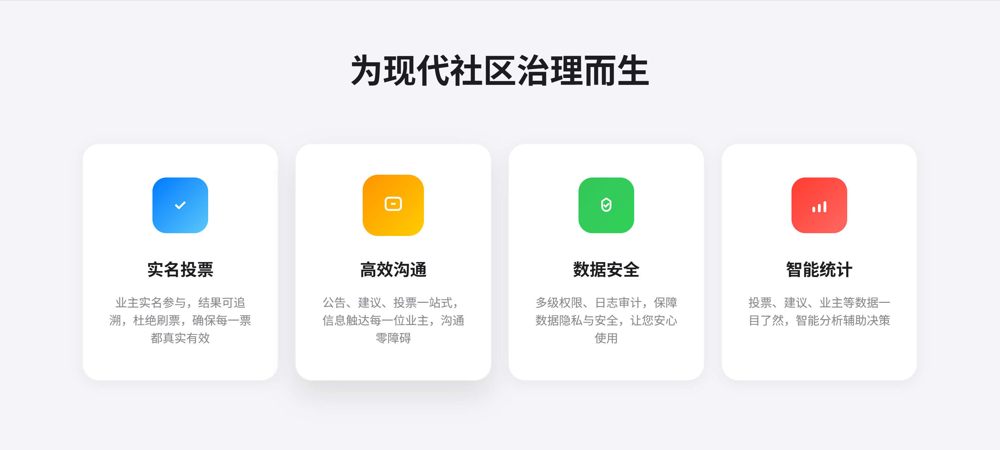

# frontend

本项目为基于 Vue 3 + Vite 的业主线上投票与自治系统前端。

## 页面预览

首页头部与主内容示意图：




## 多环境 API 地址配置

前端支持通过 `.env.development`、`.env.production` 等文件配置后端 API 地址，实现多环境联动。

示例（开发环境）：
```env
VITE_API_BASE_URL=http://localhost:8080/api
```

在代码中通过 `import.meta.env.VITE_API_BASE_URL` 获取。

请根据实际部署情况修改对应环境变量文件。

---

This template should help get you started developing with Vue 3 in Vite.

## Recommended IDE Setup

[VSCode](https://code.visualstudio.com/) + [Volar](https://marketplace.visualstudio.com/items?itemName=Vue.volar) (and disable Vetur).

## Customize configuration

See [Vite Configuration Reference](https://vite.dev/config/).

## Project Setup

```sh
npm install
```

### Compile and Hot-Reload for Development

```sh
npm run dev
```

### Compile and Minify for Production

```sh
npm run build
```
